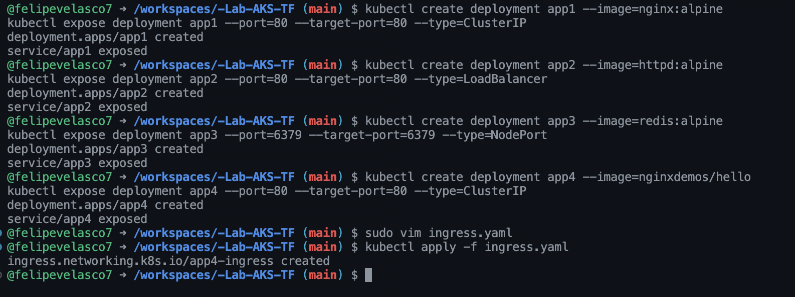
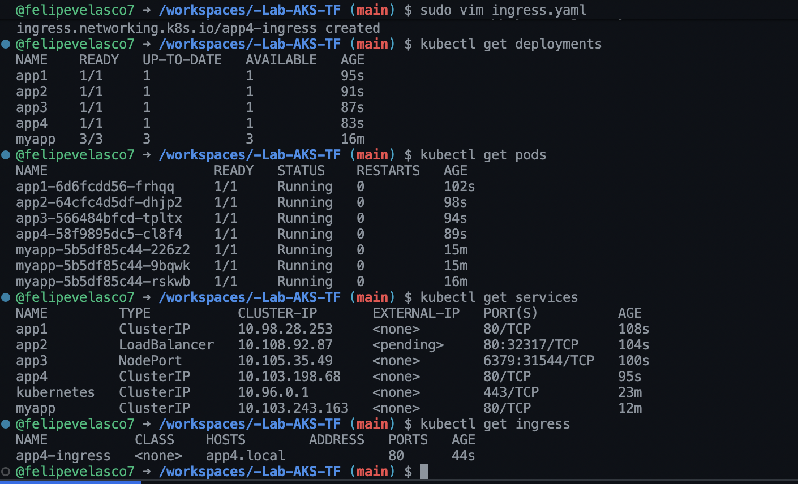
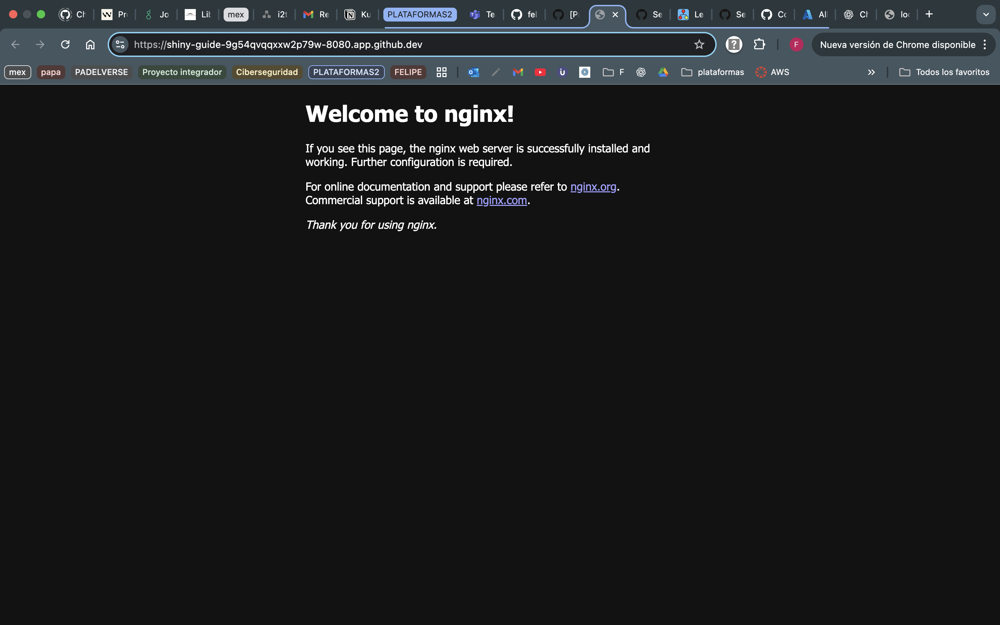

# Ejercicio-Kubernetes
Crear 4 deployments, cada uno con una imagen diferente, con 4 servicios diferentes (clusterIp con nginx, loadbalancer, nodeport, ingress)

Comandos para crear los deployments:
Deployment y servicio ClusterIP:
```bash
kubectl create deployment app1 --image=nginx:alpine
kubectl expose deployment app1 --port=80 --target-port=80 --type=ClusterIP
```
Deployment y servicio LoadBalancer:
```bash
kubectl create deployment app2 --image=httpd:alpine
kubectl expose deployment app2 --port=80 --target-port=80 --type=LoadBalancer
```
Deployment y servicio NodePort:
```bash
kubectl create deployment app3 --image=redis:alpine
kubectl expose deployment app3 --port=6379 --target-port=6379 --type=NodePort
```
Deployment y servicio para Ingress:
```bash
kubectl create deployment app4 --image=nginxdemos/hello
kubectl expose deployment app4 --port=80 --target-port=80 --type=ClusterIP
```
Para el Ingress se crea un archivo llamado ingress.yaml con el siguiente contenido:

```bash
apiVersion: networking.k8s.io/v1
kind: Ingress
metadata:
  name: app4-ingress
spec:
  rules:
  - host: app4.local
    http:
      paths:
      - path: /
        pathType: Prefix
        backend:
          service:
            name: app4
            port:
              number: 80
```
y aplicarlo con:
```bash
kubectl apply -f ingress.yaml
```


Para Verificar:
Ver deployments:
```bash
kubectl get deployments
```
Ver pods:
```bash
kubectl get pods
```
Ver servicios:
```bash
kubectl get services
```
Ver ingress:
```bash
kubectl get ingress
```


Para acceder a la página de Nginx desde fuera del clúster, se usa port-forward:
```bash
kubectl port-forward service/app1 8080:80
```
y se abre desde el localhost:8080



